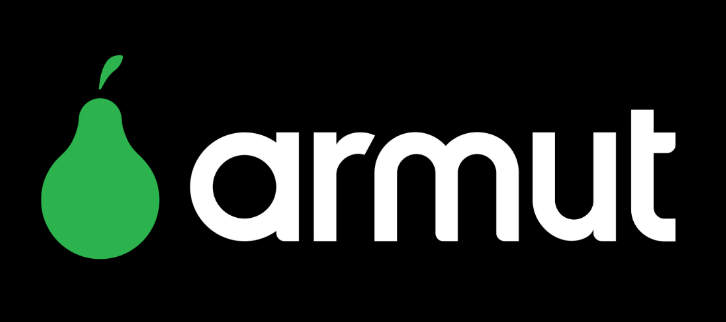

# Rule-Based-Recommender-System
## Armut Association Rule Based Recommender System

## Business Problem

Armut, Turkey's largest online service platform, brings together service providers and those who want to receive service. It provides easy access to services such as cleaning, modification and transportation with a few touches on your computer or smart phone.
It is desired to create a product recommendation system with Association Rule Learning by using the data set containing the service users and the services and categories these users have received.

- **Medium:** https://medium.com/@zeynepozisil
